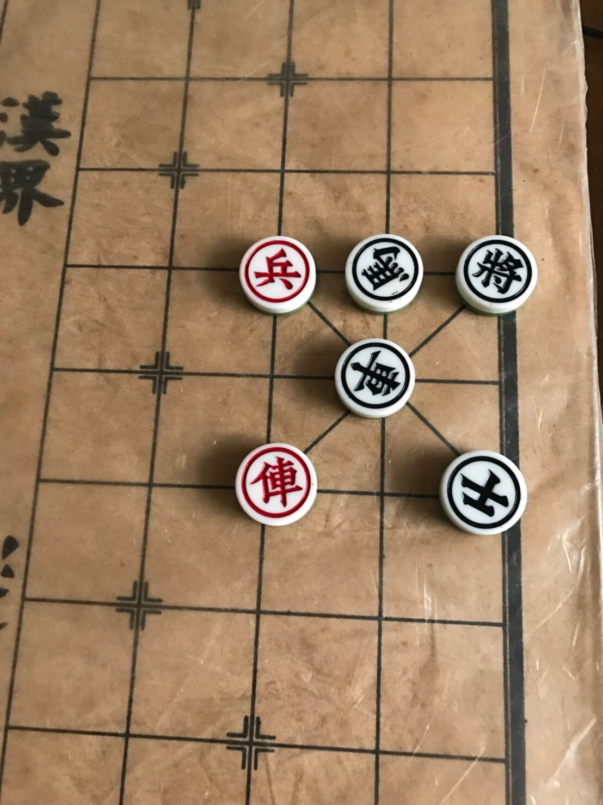
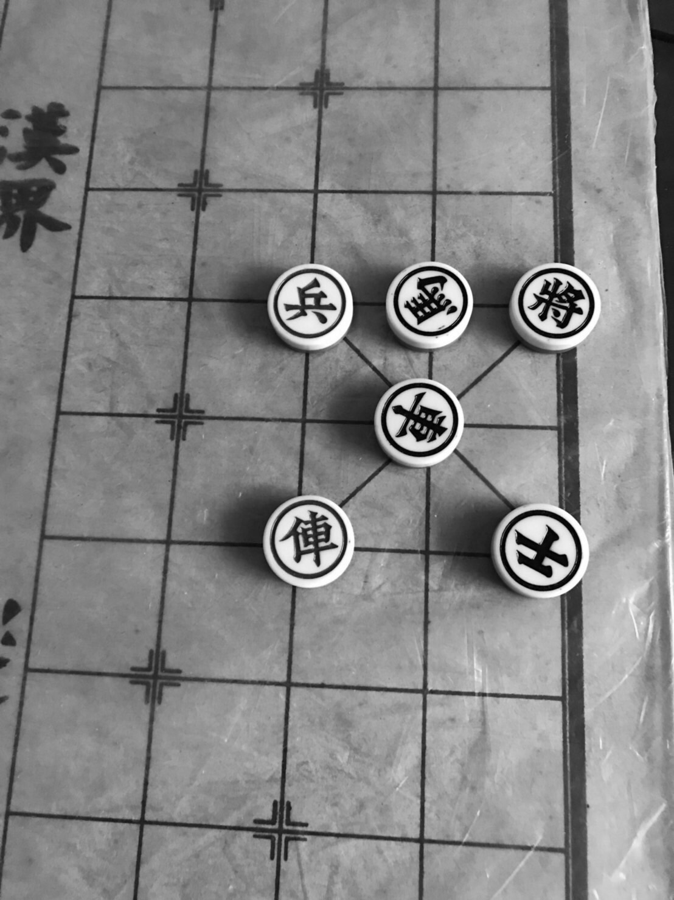
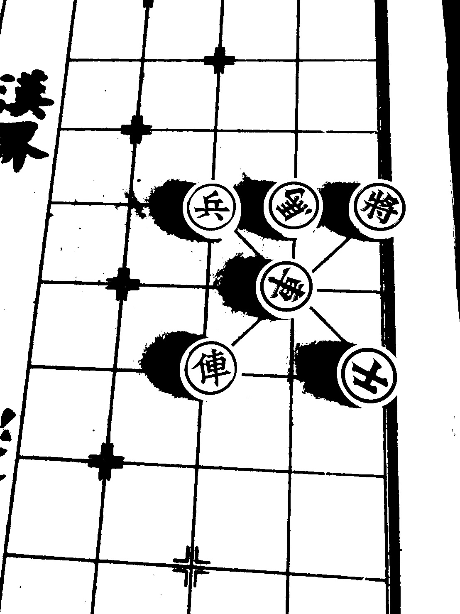
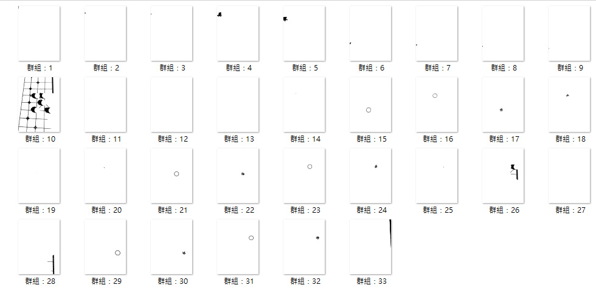
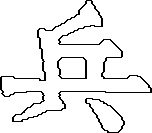
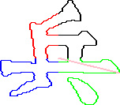
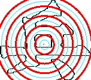
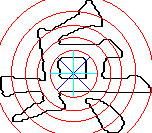

# 象棋棋盤辨識
**此專案為個人大學時期的專題之一**

製作這個項目的目的是為了能辨識象棋棋盤，但該項目只進行到辨識象棋上的文字。
此項目的難度在於，象棋的文字並非「正」或「統一」方向，所以需要在象棋是任何角度下都能辨識出上面文字。

**此項目，並未使用任何第三方Library。**

## 進行步驟

#### 1.取得包含象棋的影像

#### 2.進行灰階化

#### 3.進行二值化

#### 4.做閉合斷開(Close-Open)

#### 5.尋找出相連黑點組成的群組

#### 6.找出是圓圈的群組
其中群組15、16、21、23、29與31為圓圈。

7.取得圓圈中的群組並組成一個字。
這裡以「兵」為例子，其中群組16、18與20為該象棋一部分。

#### 8.將得到的文字影像進行正規化
將影像寬度統一為150xp，高度依比例調整。

#### 9.取得文字輪廓
將影像所有黑點往左下移動一格以及右下，這樣會得到2張文字影像。
原文字圖分別與左下及右下做XOR，會再分別得到2張部分輪廓的影像。
將2張XOR影像進行OR得到我們所要的輪廓。

#### 10.以該文字所有黑點座標平均作為中心點，並以中心點計算每個黑點至中心點距離，後取得最遠點距離

#### 11.以圓圈方式進行Fuzzy C-Means分群動作
這部分會以最遠距離為最外圈，剩餘的依想劃分的圓環平均劃分，以獲取初始群組。
我們使用了5個圓環，如途中紅圈表示，圖中青色圈部分為兩個紅圈的中間值。
(若想一張一張觀看，在img中的Circle資料夾)

#### 12.接下來在每一個圓環中進行角度的分群
這部分會以0度做一個中心角，剩餘的依想劃分的角度數量平均劃分，後以兩兩中心角中間值作為我們需要角度，以獲取初始群組。
我們使用了4個角，如深藍線表示，青色線為兩角中間值。
(因有5環，可至img/Angle查看)

#### 13.分群皆完成後，就取得道我們要的特徵了
每環中每條線的角度就是我們要的特徵，因切了5環4角所以共20個數值。
後續比對方是為，將要辨識的象棋取特徵後，與所有已存在象棋特徵進行每環角度差計算，總和起來差值最小的就會是我們所要的結果。